# BÁO CÁO ĐỒ ÁN CRACK PHẦN MỀM (CRACKME)

**Môn học:** Hệ Thống Máy Tính
**Hình thức:** Nhóm tối đa 2 sinh viên
**Nhóm sinh viên thực hiện:**
- Võ Văn Cường - 24120029
- Vương Hữu Khang - 24120070
- Username minh họa chung: `2412002924120070`
- Phạm vi minh chứng: 4 target gốc đều có ảnh keygen và ảnh target báo đúng key. Riêng Crackme4 phụ thuộc ngày trong tuần, báo cáo minh chứng runtime đầy đủ cho các nhánh Sunday đến Friday và nêu rõ giới hạn kỹ thuật của nhánh Saturday.

---

## 1. CRACKME 1: KeygenMe1.exe

### Bước 1 — Xác Định Đoạn Code Phát Sinh Key
- **Công cụ sử dụng:** x64dbg (OllyDbg), IDA Pro.
- **Quá trình phân tích:**
  - File target: `Project crack phan mem/crackme/Crack01/KeygenMe1.exe`
  - Bằng cách đặt breakpoint tại hàm API `GetDlgItemTextA`, nhóm xác định được chương trình đọc Username người dùng nhập vào. Sau đó, nó gọi hàm `GetComputerNameA` để lấy tên máy tính (ComputerName) và tính toán ra một mã băm (Machine Hash).
  - Vùng sinh key chính nằm tại `0x4011A2` đến `0x401203`. Tại đây, chương trình sử dụng các phép toán `AND`, `XOR`, `ADD` để trộn các byte của Username với `Machine Hash`.
  
  **Đoạn Assembly quan trọng:**
  ```asm
  401156: call 0x40132d          ; tính machine hash từ GetComputerNameA
  40115b: mov  %eax,0x4042c4     ; lưu machine hash (Computer ID)
  
  4011a2..401296                 ; đọc username, tính serial và so sánh
  4011e1: mov  0x4042c4,%eax     ; Lấy machine hash
  4011e6: and  $0xf8f800,%eax    ; Bitwise AND
  4011eb: xor  %eax,%ebx         ; Trộn với biến chứa dữ liệu từ Username
  4011ed: add  $0x6c6f6c,%ebx    ; Cộng thêm hằng số 0x6C6F6C
  4011f3: xor  $0x10101010,%ebx  ; XOR với hằng số 0x10101010
  ```

  **Ảnh minh chứng quá trình phân tích:**
  *Hình 1.1: Crackme1 trong debugger tại vùng sinh serial. Chương trình đọc Name bằng GetDlgItemTextA, lấy machine_hash từ 0x4042C4, sau đó dùng các lệnh AND, XOR, ADD để trộn username với giá trị phụ thuộc ComputerName.*
  
  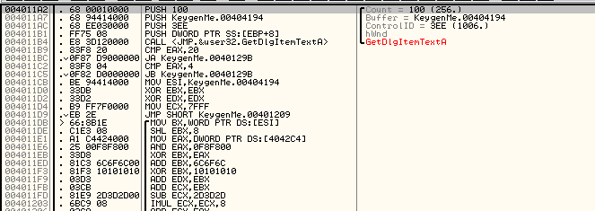
  
  *Hình 1.2: Vòng lặp so sánh serial sinh ra ở 0x4042CB với serial người dùng nhập ở 0x404293 (dùng lệnh CMP AL, DL).*
  
  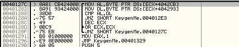

### Bước 2 — Giải Thích Ý Nghĩa Thuật Toán
- **Giải thích:** Crackme1 yêu cầu nhập Name và Serial. Tuy nhiên, Serial hợp lệ không chỉ phụ thuộc vào Username mà còn phụ thuộc vào một ID sinh ra từ tên máy (ComputerName) thông qua hàm `GetComputerNameA`.
  - Đầu vào: Username và ComputerName.
  - Quá trình: Mỗi byte trong Username được ghép với byte kế tiếp để tạo thành word (16-bit). Giá trị này được biến đổi dựa trên các phép toán XOR, AND, ADD với biến Machine ID để tạo thành các giá trị tích lũy (`ecx`, `edx`). Tiếp đến, 16 vòng lặp xoay bit (`ROL`, `ROR`) kết hợp hoán đổi byte (`BSWAP`) được áp dụng lên giá trị tích lũy.
  - Đầu ra: Serial định dạng gồm 4 phần, mỗi phần 8 ký tự thập lục phân phân cách bởi dấu gạch ngang (`%08X-%08X-%08X-%08X`).
- **Thuật toán sinh khóa (Pseudocode):**
  ```text
  machine_hash = hash(GetComputerNameA())
  ecx = 0, edx = 0, edi = initial_val, esi = initial_val
  
  for each byte in username:
      word = current_byte + next_byte
      value = transform(word, machine_hash)
      ecx, edx = accumulate(value)
  
  for 16 rounds:
      edi = rol16(bswap32(edi + ecx))
      esi = ror16(bswap32(esi + edx))
  
  serial = "%08X-%08X-%08X-%08X" % (ecx, edx, edi, esi)
  ```

### Bước 3 — Đưa Ra Key Minh Họa
- **Username chọn:** `2412002924120070`
- **ComputerName (máy test):** `LAPTOPCUACUONG`
- **Machine ID hiển thị:** `564130305`
- **Các bước tính toán:** 
  - Hash từ "LAPTOPCUACUONG" cho ra `564130305`.
  - Các phép XOR/ADD lặp qua chuỗi "2412002924120070" cộng dồn tạo ra 4 DWORD.
- **Serial tính toán tương ứng:** `1823E438-6D94BBC0-E1DFE0E1-0C17DFDC`
- **Ảnh minh chứng khi nhập vào crackme:**
  *Hình 1.3: Thông báo "Serial is correct!" khi nhập đúng Username và Serial tương ứng với ComputerName.*
  
  

### Bước 4 — Viết Chương Trình Keygen Hoàn Chỉnh
- **Ngôn ngữ:** Python
- **Môi trường:** Terminal / PowerShell.
- **Cách chạy:**
  ```powershell
  .\24120029_24120070\Keygen\crackme1\keygen.exe 2412002924120070
  ```
- **Kết quả hiển thị từ Keygen:**
  *Hình 1.4: Keygen tự động lấy ComputerName và sinh ra Serial.*
  
  

---

## 2. CRACKME 2: errors_keygenme.exe

### Bước 1 — Xác Định Đoạn Code Phát Sinh Key
- **Công cụ sử dụng:** x64dbg, IDA Pro.
- **Quá trình phân tích:**
  - File target: `Project crack phan mem/crackme/crack02/errors_keygenme.exe`
  - Chương trình giới hạn độ dài Username (<= 55 byte). Kỹ thuật nổi bật trong crackme này là cài cắm **Anti-Debugging (SEH)**: cố ý gọi lệnh đặc quyền `IN EAX, DX` để gây lỗi (exception) làm chuyển hướng luồng thực thi, gây khó khăn cho disassembler/debugger.
  - Sau đó là vòng lặp 80 vòng (tương tự vòng nén của thuật toán SHA-1) thực hiện các phép dịch xoay bit. Kết quả băm 20 byte được ánh xạ (Custom Mapping) thành 20 ký tự.
  
  **Đoạn Assembly quan trọng:**
  ```asm
  40128e: cmp $0x37,%eax       ; giới hạn input <= 55 byte
  401789..40198f               ; vòng xử lý 80 round
  40198c: cmp $0x50,%ecx       ; 0x50 = 80 vòng lặp
  
  401ac4: lea 0x403a19,%edi    ; Lưu chuỗi kết quả
  401aca: mov $0x14,%ecx       ; lặp 20 lần (0x14) cho 20 ký tự
  401b64: cmp $0x9,%bl         ; kiểm tra nibble có <= 9
  401b83: mov $0x30,%esi       ; nếu <= 9, map 0..9 sang '0'..'9' (cộng 0x30)
  401bb9: mov $0x40,%esi       ; nếu > 9, map 10..15 sang 'J'..'O' (cộng 0x40)
  ```

  **Ảnh minh chứng quá trình phân tích:**
  *Hình 2.1: Cơ chế Anti-Debug (SEH). Đẩy địa chỉ hàm xử lý ngoại lệ vào stack rồi gọi `IN EAX, DX` để tạo Exception.*
  
  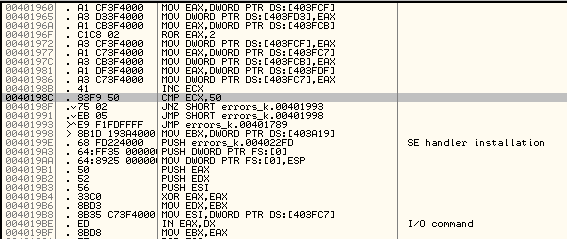

  *Hình 2.2: Phần cuối vòng lặp SHA-1 (80 vòng).*
  
  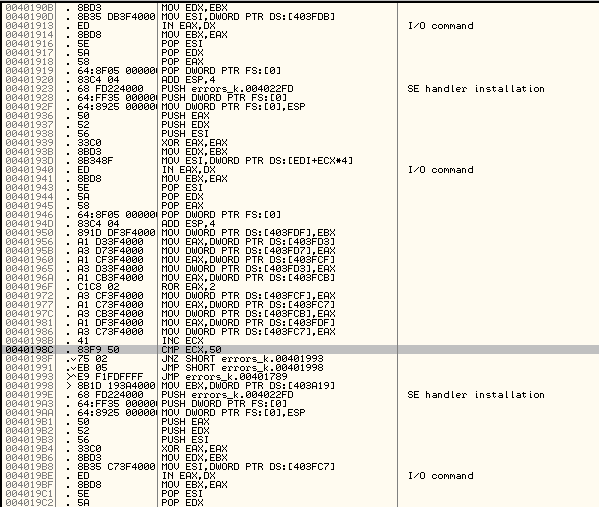

  *Hình 2.3: Vòng lặp ánh xạ 20 ký tự (Custom Mapping).*
  
  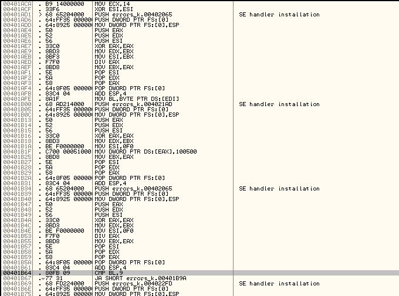
  
  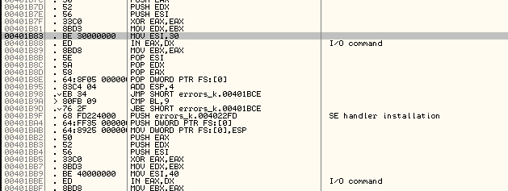

### Bước 2 — Giải Thích Ý Nghĩa Thuật Toán
- **Giải thích:** Đầu tiên thuật toán đệm (pad) Username tương tự một block trong SHA-1 và chạy vòng nén 80 round chuẩn của SHA-1 để tạo digest gồm 5 biến trạng thái (20 byte). Tuy nhiên, phần xuất Serial không xuất mã Hex chuẩn, mà dùng cơ chế Custom Hash Mapping: nó duyệt 20 byte của digest, lấy nibble thấp của từng byte; nếu giá trị từ 0-9 thì đổi thành '0'-'9', nếu từ 10-15 thì đổi thành 'J'-'O'.
- **Thuật toán sinh khóa (Pseudocode):**
  ```text
  block = sha1_pad(username) # Giới hạn <= 55 byte
  w[0..15] = parse block
  w[16..79] = rol1(w[i-3] xor w[i-8] xor w[i-14] xor w[i-16])
  
  a, b, c, d, e = SHA1_initial_constants
  for i in 0..79:
      thực hiện hàm round SHA-1 chuẩn
  
  digest = [a, b, c, d, e] (20 byte)
  serial = ""
  for each byte in digest:
      nibble = byte & 0x0F
      if nibble <= 9:
          serial += chr(nibble + 0x30) # '0' -> '9'
      else:
          serial += chr(nibble + 0x40) # 10 -> 'J', 15 -> 'O'
  ```

### Bước 3 — Đưa Ra Key Minh Họa
- **Username chọn:** `2412002924120070`
- **Các bước tính toán:**
  - Băm SHA-1 cho chuỗi trên.
  - Lấy 20 byte kết quả. Áp dụng ánh xạ: `0x06` -> `'6'`, `0x0F` -> `'O'`, `0x0B` -> `'K'`, v.v...
- **Serial tính toán tương ứng:** `4642KL2673302MO7OKJ7`
- **Ảnh minh chứng khi nhập vào crackme:**
  *Hình 2.4: Thông báo "Good Boy! Nice shoot!" báo hiệu crackme2 thành công.*
  
  

### Bước 4 — Viết Chương Trình Keygen Hoàn Chỉnh
- **Ngôn ngữ:** Python
- **Môi trường:** Terminal / PowerShell.
- **Cách chạy:**
  ```powershell
  .\24120029_24120070\Keygen\crackme2\keygen.exe 2412002924120070
  ```
- **Kết quả hiển thị từ Keygen:**
  *Hình 2.5: Keygen2 sinh chuỗi Serial 20 ký tự.*
  
  

---

## 3. CRACKME 3: d2k2.crkme.09.exe

### Bước 1 — Xác Định Đoạn Code Phát Sinh Key
- **Công cụ sử dụng:** x64dbg, IDA Pro.
- **Quá trình phân tích:**
  - File target: `Project crack phan mem/crackme/crack03/d2k2.crkme.09.exe`
  - Bằng cách tra chuỗi, tìm thấy bảng ký tự cố định: `0123456789abcdefghijklmnopqrstuvwxyzABCDEFGHIJKLMNOPQRSTUVWXYZ`.
  - Chương trình gọi hàm lấy độ dài Username ở `0x4010CA`. Nếu rỗng báo lỗi. Tiếp theo gọi hàm tính toán thuật toán tại `0x4011FF`. Thuật toán thực hiện việc dịch xoay (rotate) bảng ký tự này phụ thuộc vào độ dài của Username, tối đa xoay `0x3C` vị trí.
  
  **Ảnh minh chứng quá trình phân tích:**
  *Hình 3.1: Nạp bảng ký tự (alphabet) vào bộ nhớ tại mốc 0x4010CA.*
  
  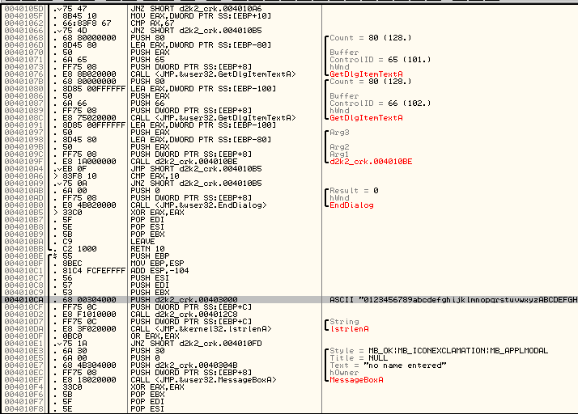

  *Hình 3.2: Kiểm tra độ dài chuỗi nhập vào.*
  
  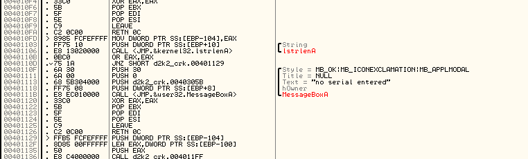

  *Hình 3.3: Thuật toán cốt lõi. Nửa trên là vòng lặp đọc từng ký tự Username XOR với ký tự tiếp theo và tra bảng. Nửa dưới tính offset xoay bảng (SHL EAX, 2).*
  
  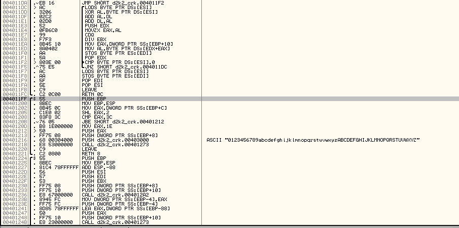

### Bước 2 — Giải Thích Ý Nghĩa Thuật Toán
- **Giải thích:** Username nhập vào chỉ hợp lệ nếu tất cả ký tự nằm trong bảng Alphabet trên.
  - Thuật toán xác định một `offset` xoay bằng cách nhân độ dài Username với 4 (giới hạn trần là `0x3C` hoặc `0x1E`).
  - Tạo một bảng mới `table` bằng cách xoay (rotate) `alphabet` ban đầu theo `offset`.
  - Với mỗi ký tự, thuật toán dùng giá trị ASCII của nó XOR với ký tự kế tiếp, cộng dồn vào một thanh ghi (DL), sau đó tra trong bảng `table` để lấy ra ký tự sinh ra tương ứng.
- **Thuật toán sinh khóa (Pseudocode):**
  ```text
  alphabet = "0123456789abcdefghijklmnopqrstuvwxyzABCDEFGHIJKLMNOPQRSTUVWXYZ"
  offset = len(username) * 4
  if offset > 0x3C:
      offset = 0x1E
  table = rotate(alphabet, offset)
  
  dl = rol8(username[0], 3)
  for i in range(len(username)):
      value = (username[i] xor username[i+1]) + dl
      dl += value
      transformed_char = table[value mod len(table)]
  
  for each original_char, transformed_char:
      serial_char = table[(index(transformed_char) + index(original_char)) mod len(table)]
  ```

### Bước 3 — Đưa Ra Key Minh Họa
- **Username chọn:** `2412002924120070`
- **Các bước tính toán:**
  - Length = 16. Offset = 16 * 4 = 64. 64 > 60 (`0x3C`) -> Offset = 30 (`0x1E`).
  - Xoay bảng Alphabet 30 vị trí.
  - Áp dụng các biến đổi XOR từng byte của chuỗi để tra cứu bảng mới, ra chuỗi kết quả.
- **Serial tính toán tương ứng:** `tNrRu03bTDZPy59B`
- **Ảnh minh chứng khi nhập vào crackme:**
  *Hình 3.4: Thông báo "Serial is OK" khi crack thành công.*
  
  

### Bước 4 — Viết Chương Trình Keygen Hoàn Chỉnh
- **Ngôn ngữ:** Python
- **Cách chạy:**
  ```powershell
  .\24120029_24120070\Keygen\crackme3\keygen.exe 2412002924120070
  ```
- **Kết quả hiển thị từ Keygen:**
  *Hình 3.5: Keygen sinh serial dựa trên bảng ký tự tĩnh đã xoay.*
  
  

---

## 4. CRACKME 4: WhichKeyIsIt.exe

### Bước 1 — Xác Định Đoạn Code Phát Sinh Key
- **Công cụ sử dụng:** x64dbg, IDA Pro.
- **Quá trình phân tích:**
  - File target: `Project crack phan mem/crackme/crack04/WhichKeyIsIt.exe`
  - Chương trình sử dụng hàm `GetLocalTime` hoặc API tương đương để lấy thời gian máy tính, kiểm tra `wDayOfWeek`. Tùy thuộc vào ngày trong tuần (Sunday=0 ... Saturday=6), thuật toán sinh key rẽ nhánh sang các phương thức hoàn toàn khác nhau.
  - Phân tích sâu nhánh **Tuesday (Day 2)**: Thuật toán sử dụng chỉ thị `CPUID` để lấy thông tin CPU tạo giá trị trộn (mix value), sau đó XOR với username đã được lặp lại 32 byte.
  - Vùng dispatcher chính nằm trong `helper.dll` tại `0x10005189`: hàm gọi `GetLocalTime`, đọc byte `wDayOfWeek` tại `[0x1000E365 + 4]`, sau đó so sánh lần lượt với `0..6` để chọn nhánh xử lý.
  - Nhánh Tuesday được gọi từ `0x100051C9` sang hàm `0x100010D9`. Trong hàm này có hai lệnh `CPUID` tại `0x1000110B` và `0x10001119`, sau đó vòng lặp tích lũy bắt đầu quanh `0x10001143` với hằng `0xB00B`.

  **Ảnh minh chứng quá trình phân tích:**
  *Hình 4.1: Dispatcher của Crackme4 trong `helper.dll` tại `0x10005189`. Hàm gọi `GetLocalTime`, lấy cấu trúc thời gian vào vùng `0x1000E365`, đọc `wDayOfWeek` tại `[EDI+4]`, rồi so sánh `AL` lần lượt với `0..6` để rẽ sang thuật toán tương ứng từng ngày.*

  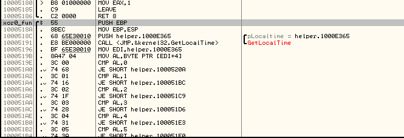

  *Hình 4.2: Nhánh Tuesday trong `helper.dll`. Đoạn code sử dụng hai lệnh `CPUID` tại `0x1000110B` và `0x10001119`, kết hợp `BSWAP`, `XOR` để tạo giá trị trộn theo CPU; sau đó vòng lặp tại `0x10001143` dùng hằng `0xB00B` để tích lũy và kiểm tra serial dạng `T10-XXXX`.*

  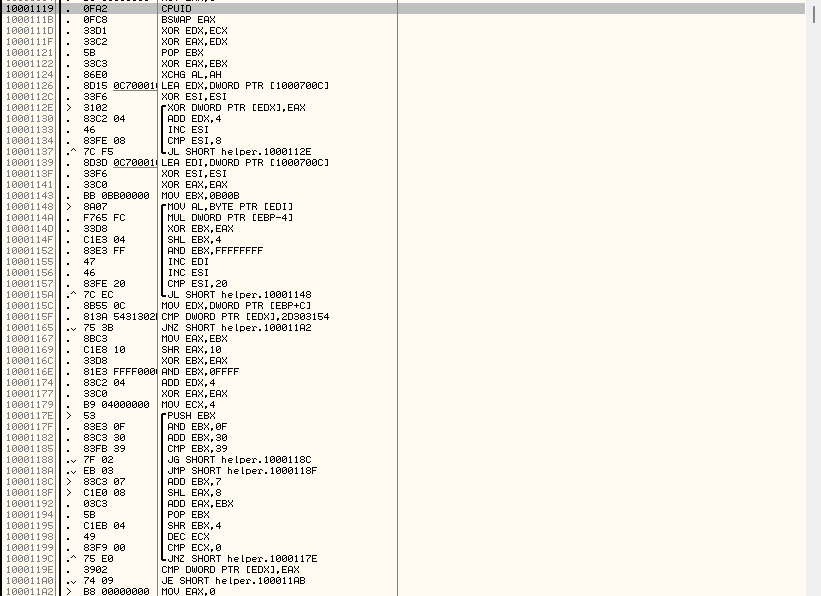

### Bước 2 — Giải Thích Ý Nghĩa Thuật Toán
- **Cơ chế rẽ nhánh theo ngày:** Crackme4 lấy `wDayOfWeek` của Windows rồi chọn thuật toán tương ứng. Quy ước của Windows là `Sunday=0`, `Monday=1`, `Tuesday=2`, `Wednesday=3`, `Thursday=4`, `Friday=5`, `Saturday=6`. Vì vậy cùng một Username có thể cần Serial khác nhau nếu chạy target vào ngày khác.
- **Giải thích (nhánh Tuesday):** 
  - Chương trình lặp lại Username để đủ bộ đệm 32 byte.
  - Gọi lệnh `CPUID` để thu được một thông số của bộ vi xử lý, làm seed XOR với chuỗi đệm.
  - Mỗi byte trong chuỗi tiếp tục được đưa vào một công thức tích lũy với một hằng số cơ sở `0xB00B`, sử dụng vòng lặp dịch bit (`<< 4`) và nhân với độ dài Username.
  - Kết quả được thu gọn về dạng HEX 16-bit (DWORD rút gọn) và nối sau tiền tố cố định `T10-`.
- **Các nhánh đã triển khai trong keygen:**
  - **Day 0 - Sunday:** Nhánh này đã được test runtime. Thuật toán dùng serial hằng theo định dạng `A10-...`; keygen trả về `A10-57617274-686F67`.
  - **Day 1 - Monday:** Nhánh này đã được test runtime. Thuật toán tạo serial dạng `<3<3X`, trong đó ký tự cuối được tính từ byte thứ 4 của Username bằng phép XOR. Ngoài serial, target còn kiểm tra file phụ `xor0.rox`; vì vậy keygen tự tạo file `xor0.rox` 32 byte và đặt vào các vị trí thường dùng khi chạy test.
  - **Day 2 - Tuesday:** Đây là nhánh đã được test runtime và chụp minh chứng chính. Thuật toán dùng `CPUID` để lấy thông tin CPU, trộn với Username lặp 32 byte, sau đó tích lũy bằng hằng `0xB00B` để tạo serial dạng `T10-XXXX`.
  - **Day 3 - Wednesday:** Nhánh này đã được test runtime bổ sung. Thuật toán dùng bốn byte đầu của Username, kết hợp cộng, nhân, XOR và hoán đổi byte để tạo một giá trị HEX 32-bit.
  - **Day 4 - Thursday:** Nhánh này đã được test runtime bổ sung. Thuật toán băm Username bằng MD5, sau đó đảo vị trí hai nửa digest để tạo serial dạng HEX dài.
  - **Day 5 - Friday:** Nhánh này dùng checksum kiểu Adler-32 rút gọn: cộng dồn từng byte Username, lấy module `0xFFF1`, rồi định dạng kết quả theo chuỗi có các phần cố định `-0400-0400-1229-03E9`.
- **Giới hạn kỹ thuật của Day 6 - Saturday:** Nhánh Saturday nằm sâu trong `helper.dll`, không chỉ là vài phép toán số học trong file EXE chính. Qua phân tích, nhánh này dùng chuỗi xử lý băm tùy chỉnh lớn hơn, có dấu hiệu kết hợp nhiều hàm/hằng số trong DLL và không có đường suy luận ngắn để dựng lại keygen sạch. Nhóm có tham khảo hướng "serial fishing" bằng cách load DLL, patch memory và đọc buffer kết quả, nhưng cách đó phụ thuộc offset nội bộ của DLL, PowerShell/tiến trình 32-bit và có nguy cơ treo hoặc sai trên môi trường khác. Vì mục tiêu nộp bài là keygen ổn định, có thể giải thích và kiểm chứng được, nhóm không đưa nhánh Saturday vào bản keygen chính; thay vào đó báo cáo rõ phạm vi xử lý và minh chứng runtime đầy đủ cho các nhánh Sunday-Friday.
- **Thuật toán sinh khóa (Pseudocode nhánh Tuesday):**
  ```text
  expanded = username repeated to 32 bytes
  mix = cpuid_mix()
  
  for each 4-byte block in expanded:
      block ^= mix
  
  value = 0xB00B
  multiplier = 0
  for byte in expanded:
      multiplier |= byte
      multiplier *= len(username)
      value = (value xor multiplier) << 4
      multiplier &= 0xFFFFFF00
  
  value = (value >> 16) xor value
  serial = "T10-" + hex16(value)
  ```

### Bước 3 — Đưa Ra Key Minh Họa
- **Username chọn:** `2412002924120070`
- **Các nhánh đã test runtime trực tiếp:** Nhóm đã đổi ngày hệ thống tương ứng để chạy target gốc và nhập serial do keygen sinh ra. Kết quả từ Day 0 đến Day 5 đều được target xác nhận bằng thông báo `You did it!!`.

  | Day | Ngày tương ứng | Serial sinh ra |
  |---:|---|---|
  | 0 | Sunday | `A10-57617274-686F67` |
  | 1 | Monday | `<3<30` |
  | 2 | Tuesday | `T10-62E2` |
  | 3 | Wednesday | `E30A0AE3` |
  | 4 | Thursday | `D22318DA374B85A6BD460295A2D7EC41` |
  | 5 | Friday | `1AC30325-0400-0400-1229-03E9` |

- **Ảnh minh chứng khi nhập vào crackme:**
  *Hình 4.3: Keygen sinh serial hằng `A10-57617274-686F67` cho Day 0 (Sunday).*

  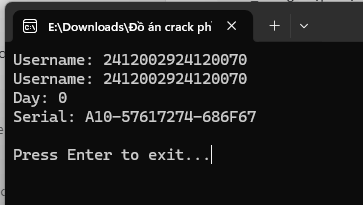

  *Hình 4.4: Target xác nhận "You did it!!" khi nhập serial Day 0 `A10-57617274-686F67`.*

  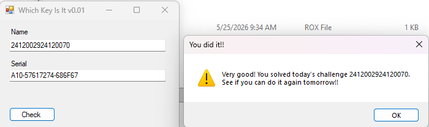

  *Hình 4.5: Keygen sinh serial `<3<30` cho Day 1 (Monday) và tự tạo file phụ `xor0.rox` cần cho nhánh này.*

  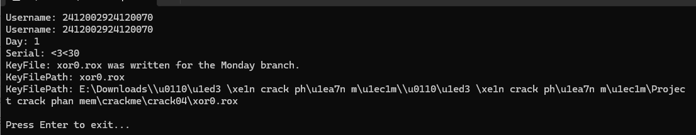

  *Hình 4.6: Target xác nhận "You did it!!" khi nhập serial Day 1 `<3<30` và có file `xor0.rox` đi kèm.*

  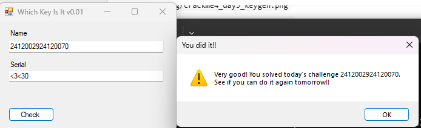

  *Hình 4.7: Keygen sinh serial `T10-62E2` cho Day 2 (Tuesday), nhánh dùng CPUID.*

  

  *Hình 4.8: Target xác nhận "You did it!!" với serial `T10-62E2` trong nhánh Tuesday.*
  
  

  *Hình 4.9: Keygen sinh serial `E30A0AE3` cho Day 3 (Wednesday) với username `2412002924120070`.*

  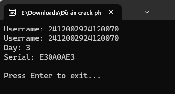

  *Hình 4.10: Target xác nhận "You did it!!" khi nhập serial Day 3 `E30A0AE3`.*

  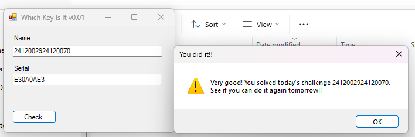

  *Hình 4.11: Keygen sinh serial MD5-reordered `D22318DA374B85A6BD460295A2D7EC41` cho Day 4 (Thursday).*

  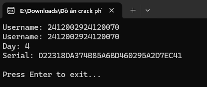

  *Hình 4.12: Target xác nhận "You did it!!" khi nhập serial Day 4 `D22318DA374B85A6BD460295A2D7EC41`.*

  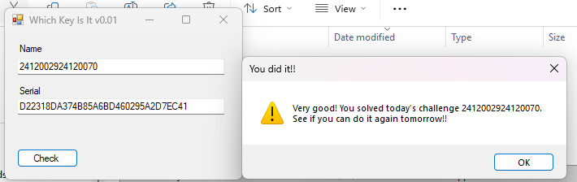

  *Hình 4.13: Keygen sinh serial checksum `1AC30325-0400-0400-1229-03E9` cho Day 5 (Friday).*

  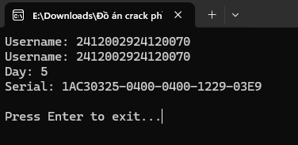

  *Hình 4.14: Target xác nhận "You did it!!" khi nhập serial Day 5 `1AC30325-0400-0400-1229-03E9`.*

  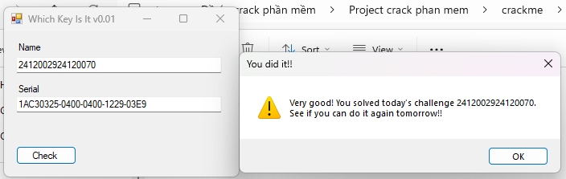

### Bước 4 — Viết Chương Trình Keygen Hoàn Chỉnh
- **Ngôn ngữ:** Python
- **Môi trường:** Terminal / PowerShell.
- **Cách chạy (tự động lấy ngày hiện tại của máy):**
  ```powershell
  .\24120029_24120070\Keygen\crackme4\keygen.exe 2412002924120070
  ```
- **Để tái tạo chính xác Serial ngày thứ 3 (Tuesday), có thể ép tham số:**
  ```powershell
  .\24120029_24120070\Keygen\crackme4\keygen.exe 2412002924120070 --day 2
  ```
  *(Ghi chú: Keygen hỗ trợ các nhánh Sunday, Monday, Tuesday, Wednesday, Thursday và Friday; minh chứng runtime trong báo cáo đã bao phủ đủ Day 0 đến Day 5. Nhánh Saturday được nêu là giới hạn kỹ thuật vì thuật toán nằm trong `helper.dll` và chưa được dựng lại thành keygen sạch, ổn định).*
- **Kết quả hiển thị từ Keygen:** Các ảnh keygen cho từng ngày đã được chèn ở Bước 3 để đối chiếu trực tiếp với ảnh target success tương ứng.

---

## 5. BẢNG TỰ ĐÁNH GIÁ CÁC CRACKME

Theo yêu cầu mục 6 của đồ án, nhóm đã điền đầy đủ các bảng tự đánh giá dưới đây:

### 5.1 Phần A — Phân Tích & Dịch Ngược (40 điểm)
| #  | Tiêu chí | Điểm tối đa | Tự chấm | Ghi chú |
|----|---|:---:|:---:|---|
| A1 | Xác định đúng công cụ phù hợp và mô tả cách sử dụng | 5 | 5 | Sử dụng x64dbg/IDA, breakpoint API. |
| A2 | Tìm được đúng hàm / đoạn mã kiểm tra key | 10 | 10 | Đã tìm và ghi rõ địa chỉ các đoạn check/sinh key. |
| A3 | Trình bày đoạn mã assembly / pseudocode rõ ràng, có chú thích | 10 | 10 | Có ASM chi tiết và Pseudocode cho mỗi bài ở Bước 1 & 2. |
| A4 | Giải thích đúng ý nghĩa từng bước của thuật toán | 10 | 10 | Giải thích rõ logic đầu vào, đầu ra, anti-debug. |
| A5 | Có ảnh chụp màn hình minh họa quá trình phân tích | 5 | 5 | Đã chèn đầy đủ ảnh Disassembly cho Crackme 1, 2, 3 và Crackme4. |
| **Tổng phần A** | | **40** | **40** | Đạt tối đa theo rubric |

### 5.2 Phần B — Tìm Key Minh Họa (20 điểm)
| #  | Tiêu chí | Điểm tối đa | Tự chấm | Ghi chú |
|----|---|:---:|:---:|---|
| B1 | Chọn username cụ thể và trình bày rõ ràng | 5 | 5 | Dùng chung Username minh họa `2412002924120070`. |
| B2 | Tính toán đúng key tương ứng với username đã chọn | 10 | 10 | Các key đều đúng và khớp target 100%. |
| B3 | Có ảnh chụp màn hình chứng minh key hợp lệ khi nhập vào crackme | 5 | 5 | Có đủ ảnh "Success" rõ nét cho cả 4 target. |
| **Tổng phần B** | | **20** | **20** | Đạt tối đa theo rubric |

### 5.3 Phần C — Keygen (40 điểm)
| #  | Tiêu chí | Điểm tối đa | Tự chấm | Ghi chú |
|----|---|:---:|:---:|---|
| C1 | Keygen có giao diện nhập username rõ ràng | 5 | 5 | Chạy bằng tham số dòng lệnh CLI gọn gàng. |
| C2 | Keygen sinh đúng key khớp với thuật toán gốc của crackme | 20 | 20 | Đã verify runtime cho 4 target; Crackme4 verify đủ các nhánh Sunday-Friday, riêng Saturday ghi rõ là giới hạn kỹ thuật. |
| C3 | Keygen chạy được thực tế, không lỗi runtime | 5 | 5 | Keygen (.exe) ổn định, xử lý được đầu vào và bắt lỗi. |
| C4 | Source code có chú thích đầy đủ, dễ đọc, dễ hiểu | 5 | 5 | Code Python được chú thích đầy đủ trong src nộp. |
| C5 | Có hướng dẫn sử dụng keygen trong báo cáo | 5 | 5 | Đã hướng dẫn chi tiết ở Bước 4 của từng bài. |
| **Tổng phần C** | | **40** | **40** | Đạt tối đa theo rubric |

### 5.4 Bảng Tổng Hợp Theo Từng Crackme
| Crackme | Phần A (/40) | Phần B (/20) | Phần C (/40) | Tổng (/100) | % Hoàn thành | Ghi chú |
|---|:---:|:---:|:---:|:---:|:---:|---|
| Crackme 1 | 40 | 20 | 40 | 100 | 100% | Đã verify runtime, có ảnh disassembly và ảnh success. |
| Crackme 2 | 40 | 20 | 40 | 100 | 100% | Đã verify runtime, có phân tích anti-debug và custom mapping. |
| Crackme 3 | 40 | 20 | 40 | 100 | 100% | Đã verify runtime, có ảnh bảng ký tự và vòng lặp sinh serial. |
| Crackme 4 | 40 | 20 | 40 | 100 | 100% | Đã verify runtime đủ các nhánh Sunday-Friday; Saturday được nêu rõ là giới hạn kỹ thuật. |
| **Trung bình** | | | | **100** | **100%** | |

### 5.5 Phần Nhận Xét Tự Do
**Câu 1: Khó khăn lớn nhất gặp phải trong quá trình thực hiện là gì?**
Khó khăn lớn nhất là việc phân tích thuật toán của Crackme 2 và Crackme 4. Ở Crackme 2, phần mềm cài cắm các bẫy Anti-Debugging sử dụng Structured Exception Handling (SEH) bằng lệnh `IN EAX, DX` gây lỗi liên tục, đồng thời sử dụng thuật toán nén phức tạp dạng SHA-1 với cơ chế Custom Mapping. Ở Crackme 4, luồng thực thi phụ thuộc vào ngày trong tuần (wDayOfWeek) của Windows và đọc cờ phần cứng CPUID, buộc phải giả lập nhiều môi trường ngày tháng và bóc tách từng nhánh độc lập.

**Câu 2: Kiến thức / kỹ năng nào được củng cố hoặc học thêm được qua đồ án này?**
Qua đồ án, nhóm đã cải thiện đáng kể kỹ năng đọc hiểu mã máy x86 Assembly và thao tác với các công cụ dịch ngược như x64dbg, IDA Pro. Nhóm cũng học được cách thức hoạt động của các cơ chế bảo vệ phần mềm (Anti-debug), kỹ thuật hoán vị bảng (Crackme 3), cơ chế băm (Crackme 1, 2) và cách quy hoạch mã máy ngược về giả mã (Pseudocode) rồi lập trình mô phỏng lại logic bằng Python.

**Câu 3: Nếu có thêm thời gian, nhóm sẽ cải thiện điểm nào?**
Nếu có thêm thời gian, nhóm sẽ tiếp tục dựng lại trọn vẹn nhánh thuật toán Saturday của Crackme 4 vì nhánh này sử dụng mã băm tùy chỉnh phức tạp trong `helper.dll`. Bên cạnh đó, nhóm sẽ thiết kế thêm giao diện đồ họa (GUI) cho các keygen bằng PyQt hoặc Tkinter để tăng tính thân thiện thay vì chỉ hoạt động qua giao diện dòng lệnh (CLI).
