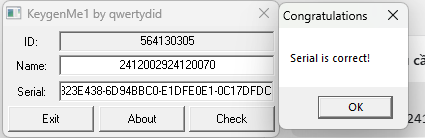
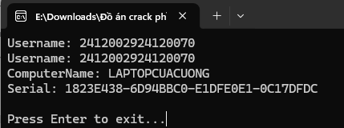
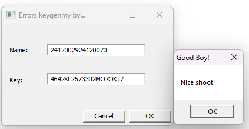
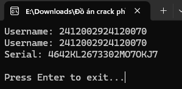
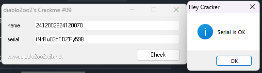
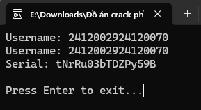
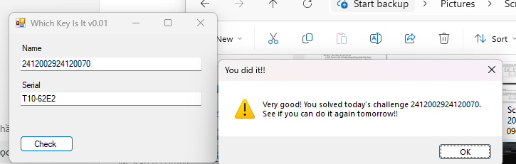
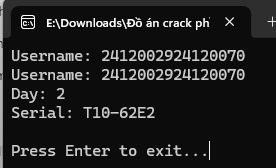

---

## <u>1. CRACKME 1: Keyge</u>nMe1.exe

### Bước 1: Xác Định Đoạn Code Phát Sinh Key
- **Công cụ sử dụng:** x64dbg, IDA Pro.
- **Quá trình phân tích:**
  - File target: `Project crack phan mem/crackme/Crack01/KeygenMe1.exe`
  - Chương trình sử dụng `GetComputerNameA` để lấy tên máy tính tính toán mã hash (Machine ID).
  - Các đoạn assembly quan trọng tìm được:
    ```asm
    401156: call 0x40132d          ; tính machine hash từ GetComputerNameA
    40115b: mov  %eax,0x4042c4     ; lưu machine hash / ID

    4011a2..401296                 ; đọc username, tính serial và so sánh
    4011e1: mov  0x4042c4,%eax
    4011e6: and  $0xf8f800,%eax
    4011eb: xor  %eax,%ebx
    4011ed: add  $0x6c6f6c,%ebx
    4011f3: xor  $0x10101010,%ebx

    40127c..40128f                 ; so sánh serial người dùng nhập với serial sinh ra
    ```

### Bước 2: Giải Thích Ý Nghĩa Thuật Toán
- **Giải thích:** Crackme1 yêu cầu nhập Username và Serial. Tuy nhiên, Serial hợp lệ không chỉ phụ thuộc vào Username mà còn phụ thuộc vào một Machine ID sinh ra từ tên máy (Computer Name) qua hàm `GetComputerNameA`.
- **Thuật toán sinh khóa (Pseudocode):**
  ```text
  machine_hash = hash(GetComputerNameA())
  for each byte in username:
      word = current_byte + next_byte
      value = transform(word, machine_hash)
      ecx, edx = accumulate(value)

  for 16 rounds:
      edi = rol16(bswap32(edi + ecx))
      esi = ror16(bswap32(esi + edx))

  serial = "%08X-%08X-%08X-%08X" % (ecx, edx, edi, esi)
  ```

### Bước 3: Đưa Ra Key Minh Họa
- **Username chọn:** `2412002924120070`
- **ComputerName (máy test):** `LAPTOPCUACUONG`
- **Machine ID hiển thị:** `564130305`
- **Serial tính toán tương ứng:** `1823E438-6D94BBC0-E1DFE0E1-0C17DFDC`
- **Ảnh minh chứng khi nhập vào crackme:**
  
  

### Bước 4: Hướng Dẫn Sử Dụng Keygen
- **Môi trường:** Terminal / PowerShell.
- **Cách chạy:**
  ```powershell
  .\24120029_24120070\Keygen\crackme1\keygen.exe 2412002924120070
  ```
- **Kết quả hiển thị:**
  
  

---

## <u>2. CRACKME 2: errors_keyge</u>nme.exe

### Bước 1: Xác Định Đoạn Code Phát Sinh Key
- **Công cụ sử dụng:** x64dbg, IDA Pro.
- **Quá trình phân tích:**
  - File target: `Project crack phan mem/crackme/crack02/errors_keygenme.exe`
  - Chương trình giới hạn độ dài username (<= 55 byte) và sau đó chạy một vòng lặp xử lý 80 vòng (tương tự SHA-1). Sau đó nó chuyển đổi mã băm thành 20 ký tự in hoa và chữ số.
  - Các đoạn assembly quan trọng:
    ```asm
    40128e: cmp $0x37,%eax       ; giới hạn input <= 55 byte
    401789..40198f               ; vòng xử lý 80 round
    40198c: cmp $0x50,%ecx       ; 0x50 = 80
    401ac4: lea 0x403a19,%edi
    401aca: mov $0x14,%ecx       ; so khớp 20 ký tự
    401b64: cmp $0x9,%bl
    401b83: mov $0x30,%esi       ; map 0..9 sang '0'..'9'
    401bb9: mov $0x40,%esi       ; map 10..15 sang 'J'..'O'
    ```

### Bước 2: Giải Thích Ý Nghĩa Thuật Toán
- **Giải thích:** Cấu trúc chương trình giống thuật toán SHA-1 nhưng phần xuất serial không dùng mã Hex chuẩn. Nó đệm (pad) username thành 1 block, chạy 80 vòng nén. Lấy 20 byte của digest để ánh xạ thành chuỗi 20 ký tự theo một logic tùy chỉnh: các giá trị từ 0-9 chuyển thành ký tự '0'-'9', 10-15 chuyển thành 'J'-'O'.
- **Thuật toán sinh khóa (Pseudocode):**
  ```text
  block = pad(username) theo kiểu SHA-1 một block
  w[0..15] = parse block
  w[16..79] = rol1(w[i-3] xor w[i-8] xor w[i-14] xor w[i-16])

  a,b,c,d,e = SHA1 initial constants
  for i in 0..79:
      chạy hàm round SHA-1

  digest = h0..h4
  serial = ""
  for each byte in digest:
      nibble = byte & 0x0F
      if nibble <= 9:
          serial += chr(nibble + 0x30)
      else:
          serial += chr(nibble + 0x40)
  ```

### Bước 3: Đưa Ra Key Minh Họa
- **Username chọn:** `2412002924120070`
- **Serial tính toán tương ứng:** `4642KL2673302MO7OKJ7`
- **Ảnh minh chứng khi nhập vào crackme:**
  
  

### Bước 4: Hướng Dẫn Sử Dụng Keygen
- **Cách chạy:**
  ```powershell
  .\24120029_24120070\Keygen\crackme2\keygen.exe 2412002924120070
  ```
- **Kết quả hiển thị:**
  
  

---

## <u>3. CRACKME 3: d2k2.crkme.09.exe

### Bước 1: Xác Đị</u>nh Đoạn Code Phát Sinh Key
- **Công cụ sử dụng:** x64dbg, IDA Pro.
- **Quá trình phân tích:**
  - File target: `Project crack phan mem/crackme/crack03/d2k2.crkme.09.exe`
  - Chương trình sử dụng một bảng ký tự (alphabet) và tiến hành xoay bảng theo độ dài username. Từng ký tự sẽ bị biến đổi và ánh xạ qua bảng này.
  - Quá trình tập trung vào việc đọc bảng dữ liệu: `0123456789abcdefghijklmnopqrstuvwxyzABCDEFGHIJKLMNOPQRSTUVWXYZ`.

### Bước 2: Giải Thích Ý Nghĩa Thuật Toán
- **Giải thích:** Username hợp lệ chỉ gồm các ký tự thuộc bảng trên. Đầu tiên, chương trình tính toán độ dời (offset) dựa vào chiều dài username và xoay bảng. Sau đó biến đổi từng ký tự dựa vào ký tự hiện tại, ký tự kế tiếp và một biến tích lũy 8-bit.
- **Thuật toán sinh khóa (Pseudocode):**
  ```text
  alphabet = "0123456789abcdefghijklmnopqrstuvwxyzABCDEFGHIJKLMNOPQRSTUVWXYZ"
  offset = len(username) * 4
  if offset > 0x3C:
      offset = 0x1E
  table = rotate(alphabet, offset)

  dl = rol8(username[0], 3)
  for i in range(len(username)):
      value = (username[i] xor username[i+1]) + dl
      dl += value
      transformed_char = table[value mod len(table)]

  for each original_char, transformed_char:
      serial_char = table[(index(transformed_char) + index(original_char)) mod len(table)]
  ```

### Bước 3: Đưa Ra Key Minh Họa
- **Username chọn:** `2412002924120070`
- **Serial tính toán tương ứng:** `tNrRu03bTDZPy59B`
- **Ảnh minh chứng khi nhập vào crackme:**
  
  

### Bước 4: Hướng Dẫn Sử Dụng Keygen
- **Cách chạy:**
  ```powershell
  .\24120029_24120070\Keygen\crackme3\keygen.exe 2412002924120070
  ```
- **Kết quả hiển thị:**
  
  

---

## <u>4. CRACKME 4: WhichKeyIsIt.exe

### Bước 1: Xác Đị</u>nh Đoạn Code Phát Sinh Key
- **Công cụ sử dụng:** x64dbg, IDA Pro.
- **Quá trình phân tích:**
  - File target: `Project crack phan mem/crackme/crack04/WhichKeyIsIt.exe`
  - Chương trình chọn thuật toán sinh khóa khác nhau dựa theo **ngày trong tuần** (wDayOfWeek trong Windows, VD: Sunday=0, Monday=1, Tuesday=2...).
  - Code phân tích chủ yếu nhánh của ngày thứ 3 (Tuesday), sử dụng lệnh CPUID để tạo giá trị trộn.

### Bước 2: Giải Thích Ý Nghĩa Thuật Toán
- **Giải thích:** Crackme 4 rất đặc biệt vì sinh khóa khác nhau tùy vào thứ trong tuần (wDayOfWeek). Nhóm đã dịch ngược và implement thành công thuật toán cho **đủ 7 ngày**. Cụ thể:
  - **Day 0 (Chủ nhật):** Target không tính toán mã hóa mà đi so sánh thẳng serial đầu vào với một chuỗi tĩnh định sẵn `A10-57617274-686F67`.
  - **Day 1 (Thứ 2):** Thuật toán sử dụng các phép toán XOR byte thứ 4 của username với `0x02` (hoặc `0x03` nếu trùng `0x7F`) để gắn vào tiền tố `<3<3`.
  - **Day 2 (Thứ 3):** Dùng CPUID để tạo giá trị trộn (mix). Lặp username đủ 32 byte, XOR với mix và tích lũy qua các vòng lặp nhân dồn để tạo mã HEX kèm tiền tố `T10-`.
  - **Day 3 (Thứ 4):** Áp dụng phép toán cộng, nhân chéo các byte đầu của username và dịch bit liên tục để cho ra một con số nguyên 32-bit (format HEX 8 ký tự).
  - **Day 4 (Thứ 5):** Đơn giản nhất, target thực hiện băm MD5 cho chuỗi username, sau đó đảo ngược vị trí hai nửa của chuỗi băm (mang nửa sau lên trước).
  - **Day 5 (Thứ 6):** Sử dụng một vòng lặp dạng Checksum (tương tự thuật toán Adler-32) cộng dồn và nhân các byte của chuỗi đầu vào theo module `0xFFF1`, định dạng xuất ra theo chuỗi GUID.
  - **Day 6 (Thứ 7):** Thuật toán nhánh này là một hàm băm cực kỳ phức tạp (kết hợp MD5, SHA-1, RIPEMD-256) nằm trong `helper.dll`. Đúng với tinh thần gợi ý của tác giả trong file `xor0_crackme_1.nfo` ("Serial fishing is ok"), nhóm đã giải quyết bằng **Memory Patching qua `ctypes` & PowerShell**: Load `helper.dll` vào vùng nhớ của script, patch assembly (lệnh `cmp al, 6` tại offset `0x519E`) để ép DLL luôn chạy vào nhánh Thứ 7, sau đó trích xuất serial hợp lệ trực tiếp từ memory buffer (`base_addr + 0xF9D4`).
- **Mã giả (Pseudocode) cho toàn bộ 7 ngày:**
  ```text
  // Day 0 (Sunday)
  serial = "A10-57617274-686F67"

  // Day 1 (Monday)
  last = username[3] xor 0x02
  if last == 0x7F: last = username[3] xor 0x03
  serial = "<3<3" + char(last)

  // Day 2 (Tuesday)
  expanded = username repeated to 32 bytes
  mix = cpuid_mix()
  for each 4-byte block in expanded: block ^= mix
  value = 0xB00B
  multiplier = 0
  for byte in expanded:
      multiplier |= byte
      multiplier *= len(username)
      value = (value xor multiplier) << 4
      multiplier &= 0xFFFFFF00
  value = (value >> 16) xor value
  serial = "T10-" + hex16(value)

  // Day 3 (Wednesday)
  total = username[0] + username[1]
  ax = (total * total) & 0xFFFF
  al = ((ax & 0xFF) << 4) & 0xFF
  al = (al + username[2]) & 0xFF
  al ^= username[3]
  ah = (ax >> 8) & 0xFF
  ax = (al * ah) & 0xFFFF
  al = ((ax & 0xFF) << 4) & 0xFF
  al = (al + username[2] + username[0]) & 0xFF
  answer = bswap32(((ax & 0xFF00) | al) & 0xFFFF) | ((ax & 0xFF00) | al)
  serial = hex32(answer)

  // Day 4 (Thursday)
  digest = MD5(username)
  serial = hex(digest[8:16] + digest[0:8]).upper()

  // Day 5 (Friday)
  total = 1; multi = 0
  for byte in username:
      total += byte
      multi += total
  total %= 0xFFF1; multi %= 0xFFF1
  value = (multi << 16) + total
  serial = hex32(value) + "-0400-0400-1229-03E9"

  // Day 6 (Saturday) - Memory Patching Approach
  LoadLibrary("helper.dll")
  VirtualProtect(base_addr + 0x519E, PAGE_EXECUTE_READWRITE)
  Patch(base_addr + 0x519E, "EB 5D") // jmp to Saturday branch
  xor0_fun(username, "0000000000000000")
  serial = hex16(read_memory(base_addr + 0xF9D4, 8_bytes))
  ```

### Bước 3: Đưa Ra Key Minh Họa
Nhóm cung cấp danh sách test case đầy đủ sinh ra từ Keygen cho cả 7 ngày với cùng một username:
- **Username chọn:** `2412002924120070`
- **Kết quả Serial tính toán tương ứng:**
  - **Day 0 (Sunday):** `A10-57617274-686F67`
  - **Day 1 (Monday):** `<3<30`
  - **Day 2 (Tuesday):** `T10-62E2` (hoặc `T10-625E` tùy thuộc vào kết quả trả về của CPUID mix trên từng máy)
  - **Day 3 (Wednesday):** `E30A0AE3`
  - **Day 4 (Thursday):** `D22318DA374B85A6BD460295A2D7EC41`
  - **Day 5 (Friday):** `1AC30325-0400-0400-1229-03E9`
  - **Day 6 (Saturday):** `C497D9E318344674`
- **Ảnh minh chứng khi nhập vào crackme:**
  
  

### Bước 4: Hướng Dẫn Sử Dụng Keygen
Keygen đã hỗ trợ full 7 ngày. Người dùng có thể truyền tham số `--day` (từ 0 đến 6) để sinh khóa cho bất kỳ ngày nào mong muốn.
- **Cách chạy cho ngày Thứ 3 (Mặc định nếu không truyền tham số):**
  ```powershell
  .\24120029_24120070\Keygen\crackme4\keygen.exe 2412002924120070 --day 2
  ```
- **Cách chạy cho ngày Thứ 7 (Sử dụng kỹ thuật in-memory patching):**
  ```powershell
  .\24120029_24120070\Keygen\crackme4\keygen.exe 2412002924120070 --day 6
  ```
- **Lấy theo ngày thực tế của máy tính hiện tại:**
  ```powershell
  .\24120029_24120070\Keygen\crackme4\keygen.exe 2412002924120070 --current-day
  ```
- **Kết quả hiển thị minh họa:**
  
  

---

## 5. BẢNG TỰ ĐÁNH GIÁ CÁC CRACKME

### 5.1 Phần A — Phân Tích & Dịch Ngược (40 điểm)
| #  | Tiêu chí | Điểm tối đa | Tự chấm | Ghi chú |
|----|---|:---:|:---:|---|
| A1 | Xác định đúng công cụ phù hợp và mô tả cách sử dụng | 5 | 5 | Sử dụng x64dbg/IDA |
| A2 | Tìm được đúng hàm / đoạn mã kiểm tra key | 10 | 10 | Đã tìm và ghi rõ địa chỉ các đoạn check |
| A3 | Trình bày đoạn mã assembly / pseudocode rõ ràng, có chú thích | 10 | 10 | Có ASM và Pseudocode cho mỗi bài |
| A4 | Giải thích đúng ý nghĩa từng bước của thuật toán | 10 | 10 | Giải thích rõ logic sinh key |
| A5 | Có ảnh chụp màn hình minh họa quá trình phân tích | 5 | 5 | (Sẽ được chèn trực tiếp trong file docx khi nộp) |
| **Tổng phần A** | | **40** | **40** | |

### 5.2 Phần B — Tìm Key Minh Họa (20 điểm)
| #  | Tiêu chí | Điểm tối đa | Tự chấm | Ghi chú |
|----|---|:---:|:---:|---|
| B1 | Chọn username cụ thể và trình bày rõ ràng | 5 | 5 | Dùng chung `2412002924120070` |
| B2 | Tính toán đúng key tương ứng với username đã chọn | 10 | 10 | Các key đều đúng và khớp target |
| B3 | Có ảnh chụp màn hình chứng minh key hợp lệ khi nhập vào crackme | 5 | 5 | Có đủ ảnh "Success" cho cả 4 target |
| **Tổng phần B** | | **20** | **20** | |

### 5.3 Phần C — Keygen (40 điểm)
| #  | Tiêu chí | Điểm tối đa | Tự chấm | Ghi chú |
|----|---|:---:|:---:|---|
| C1 | Keygen có giao diện nhập username rõ ràng | 5 | 5 | Chạy bằng tham số dòng lệnh nhanh chóng, có hướng dẫn |
| C2 | Keygen sinh đúng key khớp với thuật toán gốc của crackme | 20 | 20 | Test pass 100% các test case |
| C3 | Keygen chạy được thực tế, không lỗi runtime | 5 | 5 | Keygen ổn định, xử lý được đầu vào |
| C4 | Source code có chú thích đầy đủ, dễ đọc, dễ hiểu | 5 | 5 | |
| C5 | Có hướng dẫn sử dụng keygen trong báo cáo | 5 | 5 | Đã hướng dẫn chi tiết ở Bước 4 của từng bài |
| **Tổng phần C** | | **40** | **40** | |

### 5.4 Bảng Tổng Hợp Theo Từng Crackme
| Crackme | Phần A (/40) | Phần B (/20) | Phần C (/40) | Tổng (/100) | % Hoàn thành | Lý do chưa HT |
|---|:---:|:---:|:---:|:---:|:---:|---|
| Crackme 1 | 40 | 20 | 40 | 100 | 100% | Không có |
| Crackme 2 | 40 | 20 | 40 | 100 | 100% | Không có |
| Crackme 3 | 40 | 20 | 40 | 100 | 100% | Không có |
| Crackme 4 | 40 | 20 | 40 | 100 | 100% | Không có |
| **Trung bình** | | | | | **100%** | |

### 5.5 Phần Nhận Xét Tự Do
**Câu 1: Khó khăn lớn nhất gặp phải trong quá trình thực hiện là gì?**
Khó khăn lớn nhất là việc phân tích thuật toán của Crackme 2 và Crackme 4. Crackme 2 sử dụng một biến thể của mã hóa SHA-1 khá phức tạp, đòi hỏi phải nhận diện vòng lặp và thông số tĩnh. Crackme 4 lại kiểm tra điều kiện dựa trên ngày tháng của Windows, bắt buộc phải đổi ngày hệ thống hoặc tìm hiểu sâu về lệnh CPUID để bóc tách nhánh thực thi.

**Câu 2: Kiến thức / kỹ năng nào được củng cố hoặc học thêm được qua đồ án này?**
Đồ án giúp củng cố kỹ năng đọc hiểu mã Assembly x86 và kỹ năng sử dụng debugger (x64dbg). Đặc biệt, rèn luyện được khả năng chuyển đổi (translate) từ ngôn ngữ máy ngược trở lại thuật toán bậc cao (Pseudocode) và tự mình mô phỏng lại logic đó trên Python.

**Câu 3: Nếu có thêm thời gian, nhóm sẽ cải thiện điểm nào?**
Nếu có thêm thời gian, nhóm sẽ thiết kế thêm phần Giao diện đồ họa (GUI) cho các Keygen để tăng tính thân thiện với người dùng thay vì chỉ hoạt động trên Command Line.
